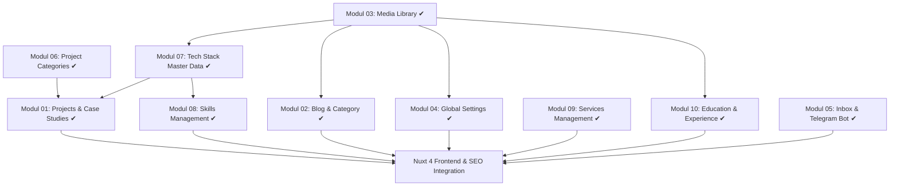

# Peta Jalan Pembangunan (Development Roadmap) — growthcoder.id

Dokumen ini mendefinisikan langkah-langkah pembangunan platform **growthcoder.id** dari posisi saat ini hingga rilis (launching) secara terstruktur berdasarkan dependensi modul.

---

## Ringkasan Progres Modul

| No | Modul | Dependensi | Status |
|---|---|---|---|
| 03 | Centralized Media Library | - | ✔ Selesai |
| 06 | Project Categories | - | ✔ Selesai |
| 07 | Tech Stack Management | Modul 03 | ✔ Selesai |
| 01 | Projects & Case Studies | Modul 03, 06, 07 | ✔ Selesai |
| 08 | Skills Management | Modul 07 | ✔ Selesai |
| 02 | Blog & Category Management | Modul 03 | ✔ Selesai |
| 04 | Global Settings & SEO | Modul 03 | ✔ Selesai |
| 09 | Services Management | - | ✔ Selesai |
| 10 | Education & Experience | Modul 03 | ✔ Selesai |
| 05 | Inbox & Otomasi Telegram Bot | - | ✔ Selesai |

---

## Diagram Alur Dependensi Data

---

## Langkah Detail Implementasi

### Langkah 1: Modul 07 (Tech Stack Management)
* **Deskripsi:** Menyimpan data master teknologi (seperti Laravel, Vue, Docker) beserta logonya yang diambil dari **Media Library**.
* **Fitur Utama:**
  - CRUD Master Teknologi.
  - Picker Logo dari Centralized Media Library (`logo_media_id`).
  - Flag *Featured* (untuk ditaruh di Homepage).
  - API endpoint publik (read-only) untuk frontend.
* **Tabel Database:** `technologies`

### Langkah 2: Modul 01 (Projects & Case Studies)
* **Deskripsi:** Modul utama portofolio untuk memamerkan studi kasus proyek Anda.
* **Fitur Utama:**
  - CRUD detail studi kasus (Rich Text/WYSIWYG).
  - Picker multi-screenshot dari Media Library (`project_images`).
  - Klasifikasi kategori utama dari Kategori Proyek.
  - Tagging tech stack (many-to-many relasi dengan `technologies`).
  - Toggle proyek unggulan (*Featured Project*) & swap order tampilan.
  - API endpoint publik (read-only) untuk detail & list.
* **Tabel Database:** `projects`, `project_technology`, `project_images`

### Langkah 3: Modul 08 (Skills Management)
* **Deskripsi:** Menampilkan visualisasi keterampilan teknis Anda dengan logo yang terpusat.
* **Fitur Utama:**
  - CRUD keterampilan dengan relasi ke master teknologi (`technology_id`).
  - Penentuan tingkat kemahiran (persentase 0-100%).
  - Estimasi tahun pengalaman kerja.
  - Swap sorting order tampilan.
  - API endpoint publik.
* **Tabel Database:** `skills`

### Langkah 4: Modul 02 (Blog & Category Management)
* **Deskripsi:** Mesin pertumbuhan SEO organik jangka panjang platform Anda.
* **Fitur Utama:**
  - CRUD Artikel (WYSIWYG) dengan cover gambar dari Media Library.
  - Status publikasi (Draft/Published/Scheduled).
  - Penghitungan otomatis estimasi waktu baca (reading time).
  - Logika related posts (artikel terkait) berdasarkan kesamaan kategori.
  - Custom SEO overrides (Meta Title/Description per postingan).
  - API endpoint publik.
* **Tabel Database:** `posts`, `categories`, `post_category`, `post_related`

### Langkah 5: Modul 04 (Global Settings & SEO)
* **Deskripsi:** Satu titik kendali pusat untuk konten global.
* **Fitur Utama:**
  - Single-row settings form di CMS Admin.
  - Teks headline & tagline dinamis di Homepage.
  - Upload file PDF CV yang dapat diunduh.
  - Link jejaring sosial (LinkedIn, GitHub, Telegram, Email, dll.).
  - Default Fallback SEO meta tags & global OG Image.
  - API endpoint publik.
* **Tabel Database:** `site_settings`

### Langkah 6: Modul 09 (Services) & Modul 10 (Education & Experience)
* **Deskripsi:** Promosi jasa profesional dan resume akademis/karir Anda.
* **Fitur Utama:**
  - **Services:** CRUD layanan jasa, deskripsi penawaran.
  - **Resume:** CRUD riwayat karir (tabel `experiences`) & pendidikan (tabel `educations`) secara kronologis dengan logo institusi dari Media Library, dikelola dalam satu halaman CMS yang sama menggunakan tab.
* **Tabel Database:** `services`, `experiences`, `educations`

### Langkah 7: Modul 05 (Inbox & Otomasi Telegram Bot)
* **Deskripsi:** Form kontak terkonversi terintegrasi notifikasi real-time.
* **Fitur Utama:**
  - POST API endpoint form kontak publik (sanitasi ketat, rate limit IP, & honeypot).
  - Laravel Queue Job untuk mengirim ringkasan pesan secara asynchronous ke bot Telegram pribadi Anda.
  - CMS Inbox Panel untuk menandai pesan (Read/Unread) atau menghapusnya.
* **Tabel Database:** `contact_messages`

---

## Tahap Rilis: Nuxt 4 Frontend & SEO
Setelah seluruh API backend rampung, tahap akhir adalah mengintegrasikannya dengan **Nuxt 4** di folder `/frontend`:
- **Server-Side Rendering (SSR):** Fetch data via `useFetch` agar terindeks sempurna oleh Googlebot.
- **Dynamic Sitemap & Robots.txt:** Sitemap dinamis yang di-update otomatis setiap kali ada proyek atau blog baru yang dipublikasikan.
- **JSON-LD Schema:** Struktur data terstandar (`Person`, `BlogPosting`) untuk menaikkan peringkat visual Google Search.
- **Image Optimization:** Pemuatan gambar supercepat menggunakan `<NuxtImg>` atau `<NuxtPicture>`.
- **Client Hydration:** Transisi halaman yang halus, filter asinkronus, dan form submission tanpa reload.
